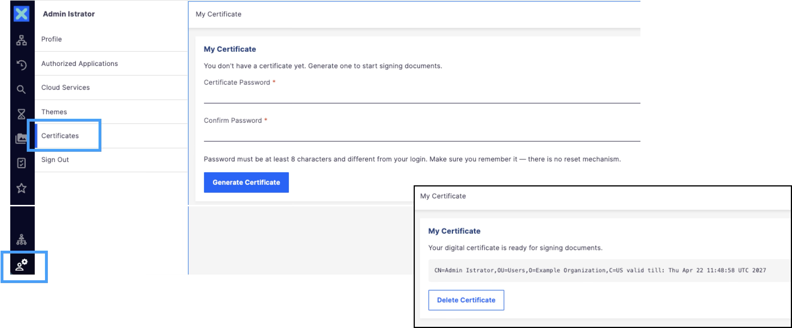
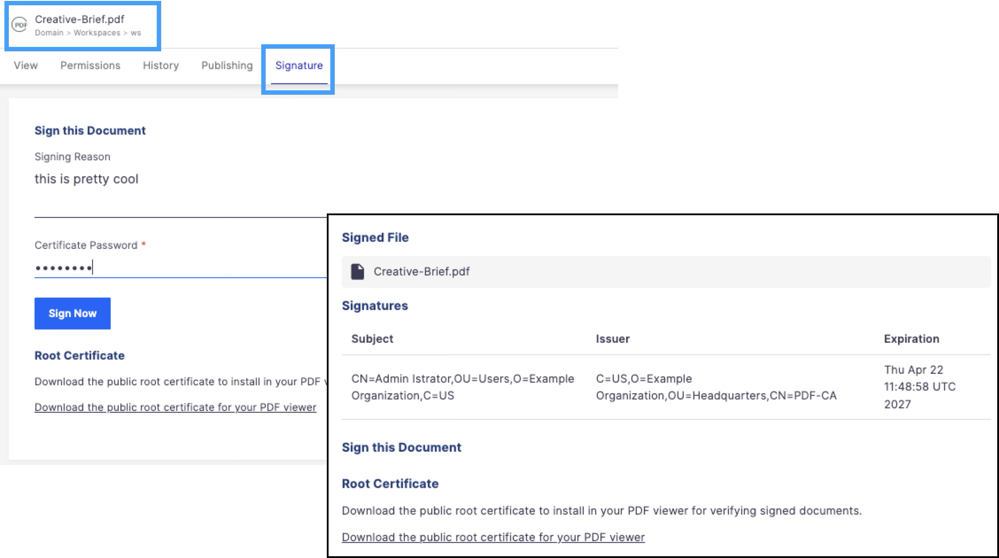
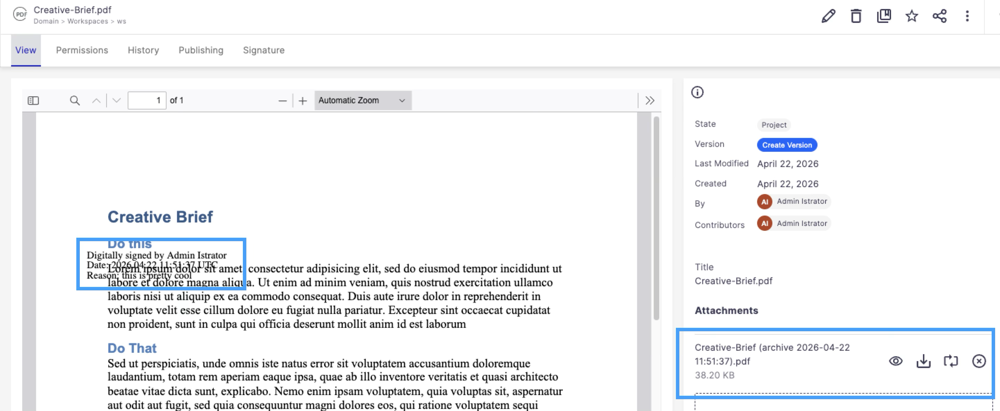

# nuxeo-labs-signature-webui

## Description

A Nuxeo LTS 2025 plugin that provides a [Nuxeo Web UI](https://doc.nuxeo.com/nxdoc/web-ui/) interface for the [Digital Signature](https://doc.nuxeo.com/nxdoc/digital-signature/) addon (`nuxeo-signature`).

The original `nuxeo-signature` plugin was deprecated in LTS 2025 because it relied on the JSF UI, which has been removed. The backend services (certificate management, PDF signing) remain fully functional — this plugin adds the missing Web UI frontend without modifying any of the original server-side code.

> [!NOTE]
> The workflow described in the [Nuxeo Digital Signature documentation](https://doc.nuxeo.com/userdoc/digital-signature/) fully applies to this plugin.

> [!IMPORTANT]
> The default root certificate shipped with `nuxeo-signature` is a sample certificate meant for testing only. For production use, you must configure your own root certificate and company information — see [Configuration](#configuration) below.

## Usage

### 1. Create a Certificate

In the left drawer, under the user menu, click **Certificates**. Set a password (minimum 8 characters, different from your login), confirm it, and click **Generate Certificate**.

> [!TIP]
> Make sure you remember your password — there is no reset mechanism.



### 2. Sign a Document

Open a document that has a file attached and go to the **Signature** tab. Enter your certificate password and an optional signing reason, then click **Sign Now**.

> [!NOTE]
> By default, when a PDF document is signed, the server archives the current file into the **Files** attachment list (`files` schema) before replacing the main file with the signed PDF. This behavior is configurable — see [Signing Behavior](#signing-behavior-nuxeoconf) below.



### 3. Download and Install the Root Certificate

From the **Signature** tab, click **Download the public root certificate for your PDF viewer** to download the root CA certificate. Install it in your system:

- **Mac**: double-click the `.crt` file and add it to the **login** keychain.
- **Windows**: double-click the `.crt` file and follow the Certificate Import Wizard.

> [!TIP]
> To verify other people's signatures, they must send you their root certificate and you install it the same way.

### 4. Verify Signatures

Open the signed PDF in your PDF viewer. The signatures are shown as valid once the root certificate is installed.



## Configuration

The `nuxeo-signature` addon can be configured via XML extensions. See the [developer documentation](https://doc.nuxeo.com/nxdoc/digital-signature/#configuration) for details. In short, it allows you to:

- Replace the sample root certificate/keystore with your own company CA.
- Set company information embedded in user certificates (country, organization, organizational unit).
- Customize the signature layout in signed PDFs (grid position, number of lines/columns, text size).

### Signing Behavior (`nuxeo.conf`)

The `nuxeo-signature` source code defines additional configuration parameters that control how signing handles the original file. These are not covered in the official documentation but can be set in `nuxeo.conf`:

| Property | Default | Description |
|----------|---------|-------------|
| `org.nuxeo.ecm.signature.disposition.pdf` | `archive` | What to do with the original file when it is a PDF |
| `org.nuxeo.ecm.signature.disposition.notpdf` | `attach` | What to do with the original file when it is not a PDF |
| `org.nuxeo.ecm.signature.pdfa` | `false` | Set to `true` to generate PDF/A-1b compliant output |
| `org.nuxeo.ecm.signature.archive.filename.format` | `" ('archive' yyyy-MM-dd HH:mm:ss)"` | `SimpleDateFormat` pattern appended to the archived filename |

The disposition properties accept three values:

- **`replace`** — The signed PDF replaces the main file (`file:content`). The original is lost.
- **`archive`** — The signed PDF replaces the main file. The original is saved as an attachment (`files:files`) with a timestamped filename.
- **`attach`** — The original stays as the main file. The signed PDF is added as an attachment.

## REST API

This plugin exposes a WebEngine REST endpoint at `/api/v1/signature/`:

| Method | Path | Description |
|--------|------|-------------|
| `GET` | `/certificate` | Check if current user has a certificate |
| `GET` | `/certificate/{username}` | Check if a specific user has a certificate (administrators only) |
| `POST` | `/certificate` | Generate a certificate (params: `password`, `passwordConfirm`) |
| `DELETE` | `/certificate` | Delete current user's certificate |
| `GET` | `/rootcertificate` | Download the root CA certificate file |
| `GET` | `/document/{docId}` | Get signing status and existing signatures |
| `POST` | `/document/{docId}` | Sign a document (params: `password`, `reason`) |

## How to Build

```bash
git clone https://github.com/nuxeo-sandbox/nuxeo-labs-signature-webui
cd nuxeo-labs-signature-webui
mvn clean install
```

To skip unit testing, add `-DskipTests`

## Future Ideas

See [Ideas.md](Ideas.md) for potential future enhancements.

## Support

**These features are not part of the Nuxeo Production platform.**

These solutions are provided for inspiration and we encourage customers to use them as code samples and learning resources.

This is a moving project (no API maintenance, no deprecation process, etc.) If any of these solutions are found to be useful for the Nuxeo Platform in general, they will be integrated directly into platform, not maintained here.

## Nuxeo Marketplace

This package is not yet published on the Nuxeo Marketplace.

## License

[Apache License, Version 2.0](http://www.apache.org/licenses/LICENSE-2.0.html)

## About Nuxeo

Nuxeo Platform is an open source highly scalable, cloud-native, enterprise content management product with rich multimedia support, written in Java. Data can be stored in both SQL & NoSQL databases.

The development of the Nuxeo Platform is mostly done by Nuxeo employees with an open development model.

The source code, documentation, roadmap, issue tracker, testing, benchmarks are all public.

More information is available at [Hyland/Nuxeo](https://www.hyland.com/en/solutions/products/nuxeo-platform).
